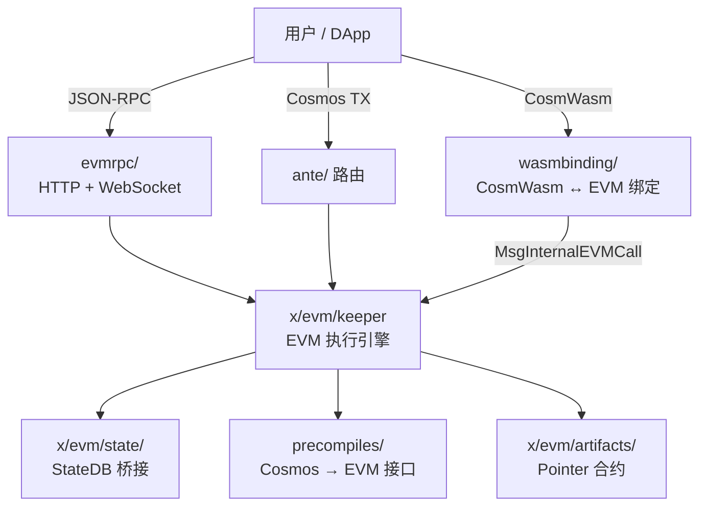
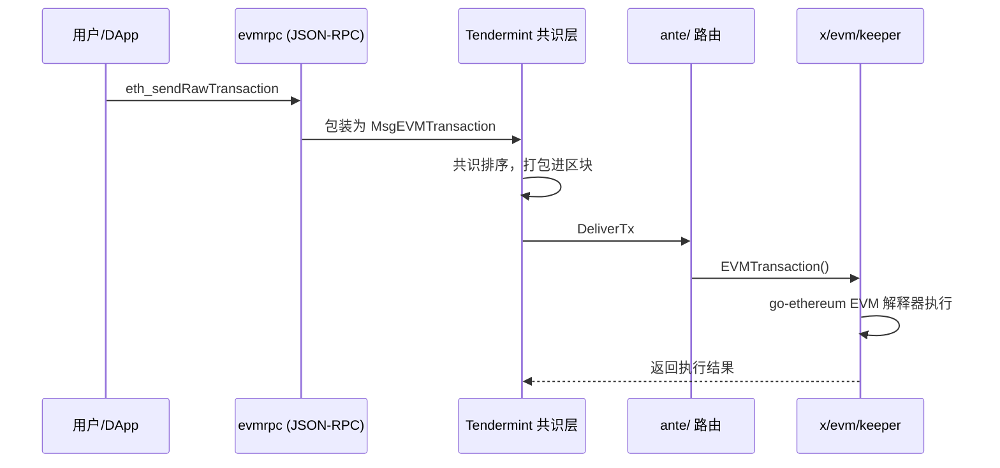
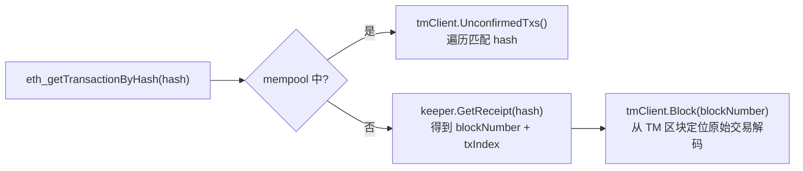
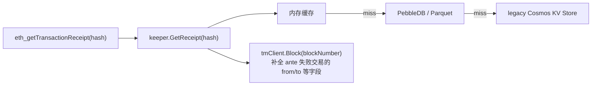
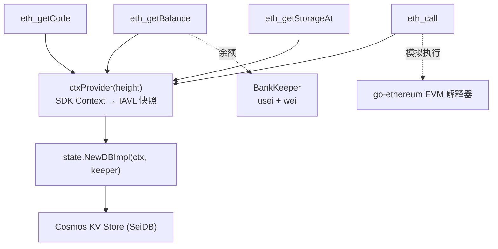
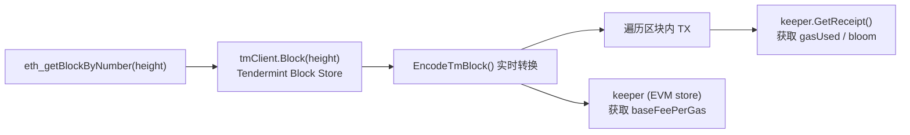

# Sei Chain EVM 功能概览

Sei 的 EVM 是**深度集成**方案——在 Cosmos SDK 存储层上运行 go-ethereum 的 EVM 解释器，实现 CosmWasm 与 EVM 的完全互操作。

## 架构简图



---

## 1. `x/evm/` — EVM 核心模块

Cosmos SDK 的 EVM 模块，将完整的以太坊虚拟机集成到 Sei 链中。

### 核心子包

| 子包 | 说明 |
|------|------|
| `keeper/` | EVM 执行引擎、地址管理、余额、nonce、receipt、pointer 合约、fee 管理（40+ 文件） |
| `state/` | 在 Cosmos store 上实现 go-ethereum 的 `StateDB` 接口（usei/wei 双精度余额、snapshot/revert、journal、transient storage） |
| `types/` | Protobuf 消息（`MsgEVMTransaction`、`MsgInternalEVMCall` 等）、参数、错误码、key 定义、链配置 |
| `types/ethtx/` | 以太坊交易类型（Legacy、EIP-2930 AccessList、EIP-1559 DynamicFee、EIP-7702 SetCode） |
| `ante/` | EVM 专用 ante handler 链（路由、签名验证、nonce 校验、fee 验证、gas 计量、Cosmos 字段拒绝等） |
| `artifacts/` | 内嵌 pointer 合约字节码（CW20/CW721/CW1155/ERC20/ERC721/ERC1155/native/wsei） |
| `migrations/` | 存储迁移（base fee、EIP-1559 参数、bloom、pointer 升级等，15+ 迁移） |
| `config/` | EVM 链配置（ChainConfig、硬分叉参数） |
| `derived/` | 派生数据结构 |
| `querier/` | gRPC 查询服务 |
| `replay/` | 以太坊区块重放配置 |
| `blocktest/` | 以太坊 blocktest 测试框架配置 |
| `client/` | CLI 与 WASM 绑定 |

### 核心特性

- **双地址模型**：Sei (bech32) ↔ EVM (hex) 双向映射，支持显式关联和默认 cast 地址
- **支持的交易类型**：Legacy、EIP-2930、EIP-1559、EIP-7702 (SetCode)、Associate（Sei 专有）
- **EIP-1559 动态 base fee**：逐块根据 gas 使用量调整
- **Pointer 合约**：CW20↔ERC20、CW721↔ERC721、CW1155↔ERC1155 双向互操作
- **Deferred processing**：bloom filter、fee surplus、错误 receipt 在 EndBlock 汇总
- **Synthetic receipts**：跨 CW/EVM 调用产生的合成 receipt 和日志

---

## 2. `evmrpc/` — EVM JSON-RPC 服务

实现以太坊兼容的 JSON-RPC API 服务器（HTTP + WebSocket）。

### 关键文件

| 文件 | 说明 |
|------|------|
| `server.go` | HTTP/WS 服务器初始化，注册所有 RPC namespace |
| `block.go` | `eth_getBlockBy*` 系列 |
| `tx.go` | `eth_getTransaction*`、`eth_getTransactionReceipt` |
| `send.go` | `eth_sendRawTransaction` |
| `filter.go` | `eth_getLogs`、`eth_newFilter` 等日志过滤 |
| `state.go` | `eth_getBalance`、`eth_getCode`、`eth_getStorageAt` |
| `simulate.go` | `eth_call`、`eth_estimateGas` |
| `tracers.go` | `debug_traceTransaction`、`debug_traceBlockByNumber` 等 |
| `subscribe.go` | WebSocket 订阅（`eth_subscribe`） |
| `bloom.go` | Bloom filter 相关 |
| `association.go` | Sei/EVM 地址关联查询 |
| `info.go` | `eth_chainId`、`eth_gasPrice` 等 |
| `txpool.go` | `txpool_*` 端点 |
| `net.go` | `net_*` 端点 |
| `web3.go` | `web3_*` 端点 |
| `sei_legacy.go` | `sei_*`/`sei2_*` 旧版端点（含 Cosmos 交易可见性） |
| `worker_pool.go` | RPC 请求的 worker pool 并发控制 |
| `watermark_manager.go` | 区块高度可用性管理 |
| `config/` | RPC 服务器配置（端口、超时、worker 池大小） |
| `stats/` | RPC 调用追踪统计 |

### 关键特性

- **即时最终性**：无 `pending` 概念，`pending` 等同于 `latest`
- **`sei_*` 端点**：可见 EVM + Cosmos synthetic receipt 交易
- **`sei2_*` 端点**：区块中包含 bank transfer
- **Legacy API 网关**：通过 `app.toml` 白名单控制，已标记为废弃
- **Debug tracing**：忠实重放历史执行
- **不支持**：uncle/trie/PoW/blob 等以太坊特性

---

## 3. `precompiles/` — EVM 预编译合约

将 Cosmos SDK 原生功能暴露给 EVM 调用者。每个预编译都有 Solidity 接口、ABI 定义、Go 实现和版本控制。

### 注册的预编译

| 预编译 | 路径 | 说明 |
|--------|------|------|
| **Bank** | `precompiles/bank/` | EVM 中访问 Cosmos bank 模块（转账、余额查询） |
| **Staking** | `precompiles/staking/` | EVM 中质押/解质押/重委托操作 |
| **Gov** | `precompiles/gov/` | EVM 中提案投票 |
| **Distribution** | `precompiles/distribution/` | EVM 中领取质押奖励 |
| **Oracle** | `precompiles/oracle/` | EVM 中查询预言机数据 |
| **IBC** | `precompiles/ibc/` | EVM 中发起 IBC 跨链转账 |
| **Wasmd** | `precompiles/wasmd/` | EVM 中调用 CosmWasm 合约 |
| **Addr** | `precompiles/addr/` | Sei ↔ EVM 地址转换 |
| **Pointer** | `precompiles/pointer/` | 注册/管理 pointer 合约 |
| **PointerView** | `precompiles/pointerview/` | 查询 pointer 合约信息 |
| **JSON** | `precompiles/json/` | EVM 中的 JSON 解析工具 |
| **P256** | `precompiles/p256/` | P-256 (secp256r1) 签名验证 |
| **Solo** | `precompiles/solo/` | Solo 预编译 |

### 架构模式

- 统一基类 `precompiles/common/precompiles.go` 实现 `vm.PrecompiledContract`
- `precompiles/setup.go` 负责所有预编译的初始化和注册
- `precompiles/utils/expected_keepers.go` 定义 keeper 接口
- 每个预编译通过 `GetVersioned()` 支持按区块高度分版本

---

## 4. `app/` 中的 EVM 集成

| 文件 | 说明 |
|------|------|
| `app/precompiles.go` | `PrecompileKeepers` 结构体——将所有 Cosmos keeper 包装为预编译所需的接口 |
| `app/eth_replay.go` | 以太坊区块重放引擎——从以太坊主网拉取区块并在 Sei 上重放执行，逐交易验证余额和状态 |
| `app/abci.go` | ABCI 层 EVM 交易处理——提取 EVM nonce/sender/txhash，构建 `EvmTxInfo` |
| `app/ante.go` | Ante handler 路由——区分 EVM 和 Cosmos 交易走不同处理链 |
| `app/receipt.go` | Receipt 处理和存储 |

---

## 5. 其他 EVM 相关

| 路径 | 说明 |
|------|------|
| `contracts/` | Hardhat 项目——EVM 合约源码、测试、部署脚本 |
| `integration_test/evm_module/` | EVM 模块集成测试 |
| `wasmbinding/` | CosmWasm ↔ EVM 绑定（查询和消息） |

---

## 6. EVM 交易排序与执行流程

EVM 交易的完整生命周期：

1. 用户通过 JSON-RPC 发送 `eth_sendRawTransaction`
2. 原始以太坊交易被包装为 Cosmos 的 `MsgEVMTransaction` 消息
3. 经过 **Tendermint/CometBFT 共识层**排序，进入区块
4. 在 `DeliverTx` 阶段路由到 `x/evm/keeper` 的 `EVMTransaction()` 执行



---

## 7. EVM 数据存储架构

### 7.1 EVM Transaction — Tendermint Block Store

EVM 交易作为 `MsgEVMTransaction`（Cosmos TX）存储在 **Tendermint Block Store** 中，**不独立存储**。查询交易时通过 receipt 中的 txHash 定位到 Tendermint 区块中的原始交易。

### 7.2 EVM Chain State — Cosmos KV Store

所有 EVM 链状态存储在 EVM 模块的 Cosmos KV Store（store key = `"evm"`）中。前缀定义在 `x/evm/types/keys.go`：

| 前缀 | 数据 | Key 格式 | Value |
|------|------|---------|-------|
| `0x01` | EVM→Sei 地址映射 | `evmAddr (20B)` | Sei bech32 地址 bytes |
| `0x02` | Sei→EVM 地址映射 | `seiAddr` | EVM 地址 (20B) |
| `0x03` | 合约存储槽 | `address (20B) + slotHash (32B)` | value (32B) |
| `0x07` | 合约字节码 | `address (20B)` | 原始字节码 |
| `0x08` | 代码哈希 | `address (20B)` | keccak256 hash (32B) |
| `0x09` | 代码大小 | `address (20B)` | uint64 (8B) |
| `0x0a` | Nonce | `address (20B)` | uint64 (8B) |
| `0x0d` | BlockBloom | 覆盖式写入 | 当前块合并 bloom |
| `0x15` | Pointer 注册 | ERC20/721/1155 | pointer 合约地址 |
| `0x1b` | BaseFeePerGas | — | 当前基础费 |
| `0x1c` | NextBaseFeePerGas | — | 下一块基础费 |

**余额例外**：余额**不在 EVM store 中**，而是通过 **Bank 模块**存储，采用双精度设计：

- `usei`（6 位小数）：Cosmos 原生，存在 Bank 模块
- `wei`（额外 12 位小数）：`1 usei = 10^12 swei`，通过 BankKeeper 扩展方法管理
- 对外展示 18 位小数（swei），兼容以太坊应用

**桥接层**：`x/evm/state/DBImpl` 实现了 go-ethereum 的 `vm.StateDB` 接口，将 EVM 读写映射到上述 Cosmos KV Store。

### 7.3 EVM Block — 不独立存储，实时派生

EVM 区块**没有独立存储**。JSON-RPC 返回的以太坊格式区块由 `evmrpc/block.go` 从 Tendermint 区块实时转换：

| EVM 字段 | 来源 |
|---------|------|
| `number` | `block.Block.Height` |
| `hash` | Tendermint `BlockID.Hash` |
| `parentHash` | `Block.LastBlockID.Hash` |
| `miner` | `Block.ProposerAddress` |
| `timestamp` | `Block.Time` |
| `baseFeePerGas` | EVM store `0x1c` |
| `gasUsed` | 累计各 receipt 的 GasUsed |
| `logsBloom` | EVM store `0x0d` (块级合并 bloom) |
| `difficulty/nonce/uncles` | 固定为空值（不适用） |

唯一持久化的区块级数据是 **BlockBloom**（前缀 `0x0d`），存在 EVM KV Store 中。

### 7.4 EVM TX Receipt — 独立 Receipt Store

Receipt 存储最复杂，分三层架构：

```
┌────────────────────────────────────────────┐
│  Layer 1: Transient Store（块内临时）         │
│  交易执行后 WriteReceipt → SetTransientReceipt │
│  生命周期：单个区块内                           │
├────────────────────────────────────────────┤
│  Layer 2: 内存缓存（cachedReceiptStore）      │
│  最近数百块的 receipt                         │
├────────────────────────────────────────────┤
│  Layer 3: 持久化 Receipt Store               │
│  后端：PebbleDB（默认）或 Parquet             │
│  目录：{home}/data/receipt.db               │
│  Key：ReceiptKeyPrefix(0x0b) + txHash       │
└────────────────────────────────────────────┘
```

**Receipt 生命周期**：

1. **交易执行时** → `SetTransientReceipt()` 写入 transient store
2. **EndBlock** → `FlushTransientReceipts()` 遍历 transient store，批量写入持久化 Receipt Store
3. **查询时** → 内存缓存 → PebbleDB/Parquet → fallback 到 legacy Cosmos KV Store

### 7.5 存储总结

| 数据 | 存储位置 | 独立 DB？ |
|------|---------|----------|
| **EVM Transaction** | Tendermint Block Store（作为 Cosmos TX） | 否 |
| **EVM Chain State** | Cosmos KV Store（`"evm"` module），余额在 Bank 模块 | 否 |
| **EVM Block** | 不存储，从 Tendermint 区块实时派生 | — |
| **EVM TX Receipt** | 独立 Receipt Store（PebbleDB/Parquet） | **是**，`data/receipt.db` |

---

## 8. evmrpc 查询架构

### 8.1 evmrpc 不是独立进程

evmrpc HTTP/WS 服务器运行在 **seid 进程内部**，通过 goroutine 启动，直接共享进程内的 keeper、Tendermint 客户端、Cosmos 状态等对象，**不经过任何网络调用**。

启动链路：`seid` 启动 → `App.RegisterTendermintService()` → `evmrpc.NewEVMHTTPServer()` → 等待第一个区块 EndBlock 信号后开始监听 8545 端口。

核心依赖注入：

| 参数 | 类型 | 作用 |
|------|------|------|
| `tmClient` | `rpcclient.Client` | Tendermint RPC 客户端（进程内调用） |
| `keeper` | `*keeper.Keeper` | EVM keeper，直接内存访问 |
| `ctxProvider` | `func(int64) sdk.Context` | 按高度获取 SDK 上下文 |
| `app` | `*baseapp.BaseApp` | 用于 DeliverTx 重放 |
| `stateStore` | `types.StateStore` | SeiDB 状态存储 |

### 8.2 ctxProvider 机制

`ctxProvider` 是统一的状态访问抽象，传入区块高度，返回指向对应 IAVL 快照的 `sdk.Context`：

- **`height = -1`（latest）**：返回 CheckTx 上下文（最新已提交状态）
- **具体高度**：调用 `app.CreateQueryContext(height, false)`，创建指向该历史高度的只读快照上下文

### 8.3 查询 EVM Transaction（`eth_getTransactionByHash`）



**数据源**：Receipt Store（定位交易位置）+ Tendermint Block Store（获取原始交易数据），都是进程内直接访问。

### 8.4 查询 EVM TX Receipt（`eth_getTransactionReceipt`）



**数据源**：Receipt Store（主要）+ Tendermint Block Store（补全信息）。

### 8.5 查询 EVM Chain State（`eth_getBalance` / `eth_getCode` / `eth_getStorageAt` / `eth_call`）



**数据源**：全部通过 Cosmos KV Store（SeiDB/IAVL），`ctxProvider` 提供对应高度的快照上下文。`eth_call` 额外调用 go-ethereum 的 EVM 解释器做模拟执行。

### 8.6 查询 EVM Block（`eth_getBlockByNumber` / `eth_getBlockByHash`）



**字段映射**：`number` ← Block.Height, `hash` ← BlockID.Hash, `miner` ← ProposerAddress, `baseFeePerGas` ← EVM store `0x1c`, `gasUsed` ← 累计 receipt.GasUsed, `logsBloom` ← OR 合并各 receipt bloom。

### 8.7 高度一致性保障：WatermarkManager

由于区块数据、链状态、receipt 分别存在不同的存储后端，写入进度可能不一致。`WatermarkManager` 取三者的**最小高度**作为安全的"最新可查高度"，避免查询到尚未完全同步的数据。

### 8.8 架构总图

```
┌─────────────────── seid 进程 ───────────────────────┐
│                                                      │
│  evmrpc Server (goroutine, :8545/:8546)              │
│  ├─ StateAPI ──────→ ctxProvider → keeper → KV Store │
│  ├─ TransactionAPI → keeper.GetReceipt → Receipt DB  │
│  │                   tmClient.Block → Block Store     │
│  ├─ BlockAPI ──────→ tmClient.Block + GetReceipt     │
│  ├─ SimulationAPI ─→ state.DBImpl → geth EVM 执行    │
│  ├─ FilterAPI ─────→ keeper logs + tmClient blocks   │
│  └─ DebugAPI ──────→ app.DeliverTx 重放执行          │
│       │                    │                │        │
│       ▼                    ▼                ▼        │
│  ┌─────────┐    ┌──────────────┐   ┌──────────────┐ │
│  │ Cosmos  │    │  Tendermint  │   │ Receipt Store│ │
│  │ KV Store│    │  Block Store │   │ (PebbleDB)   │ │
│  │ (SeiDB) │    │              │   │ receipt.db   │ │
│  └─────────┘    └──────────────┘   └──────────────┘ │
│                                                      │
│  全部进程内直接访问，无网络开销                          │
└──────────────────────────────────────────────────────┘
```
