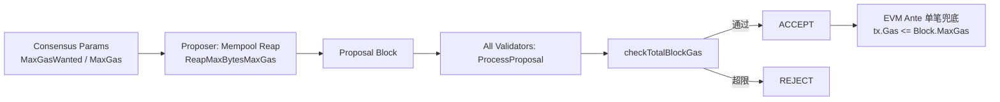
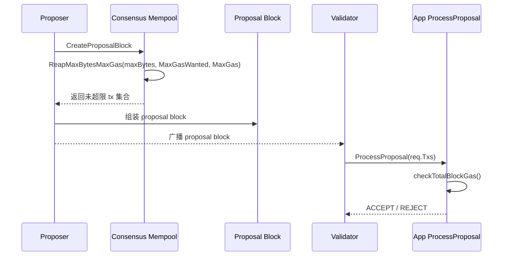
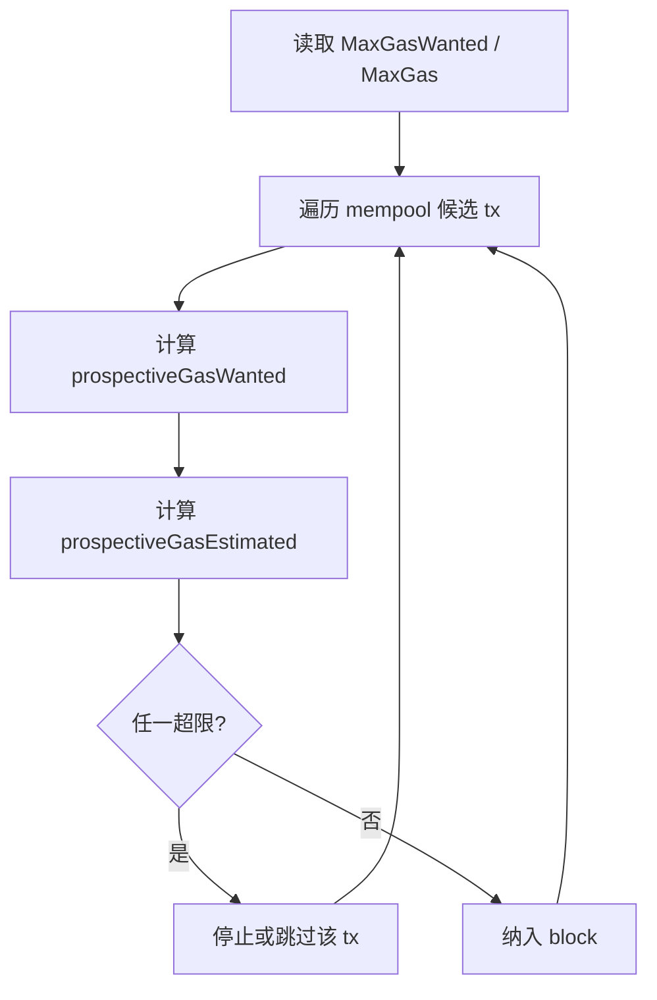
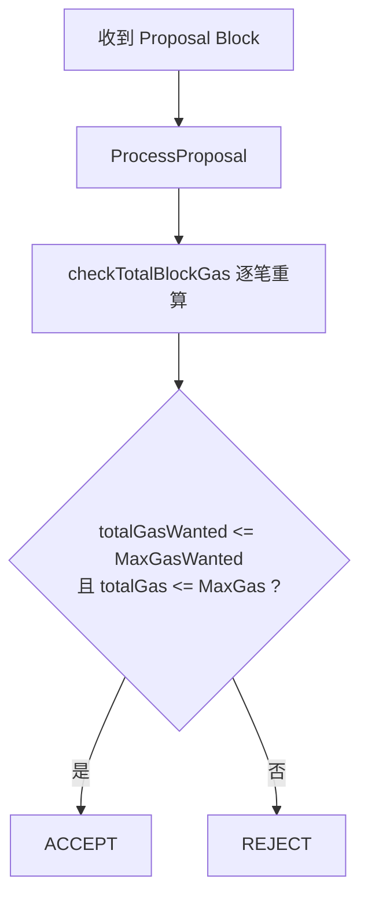

# Sei Chain 每个 Block 内 EVM Tx 总 Gas 限制与检查

本文只保留与主题直接相关的内容：Sei 如何对每个 block 中 EVM tx 的总 gas 做限制与校验。

## 1. 框架图

核心含义：

1. 第一层限制在 proposer 打包时执行。
2. 第二层限制在全网 `ProcessProposal` 重新计算后执行。
3. 第三层是 EVM ante 的单笔上限兜底。

## 2. Proposer / Validator 职责分层

这一层关系可以概括为：

1. `mempool.ReapMaxBytesMaxGas` 负责 proposer 自己打包时的前置限制。
2. `ProcessProposal -> checkTotalBlockGas` 负责验证者收到外部 proposal 后的独立复核。
3. 因此 mempool 不是最终安全边界，`ProcessProposal` 才是全网一致拒绝坏 proposal 的关键校验点。

## 3. 总 Gas 统计规则

Sei 同时维护两个区块级累计值：

$$
G_w = \sum_i gasWanted_i
$$

$$
G_t = \sum_i f(i)
$$

其中对 EVM tx：

$$
f(i)=
\begin{cases}
gasEstimate_i, & 21000 \le gasEstimate_i \le gasWanted_i \\
gasWanted_i, & otherwise
\end{cases}
$$

区块通过条件：

$$
G_w \le MaxGasWanted
\quad,\quad
G_t \le MaxGas
$$

## 4. 打包流程（Proposer 侧）

要点：

1. proposer 在构造 block 时，就已经受双阈值约束。
2. 这一层发生在共识层，从 mempool 取交易时完成。

## 5. 验块流程（全网 ProcessProposal）

要点：

1. 这一层发生在 ABCI `ProcessProposal` 中。
2. `checkTotalBlockGas` 是执行层对 proposal tx 集合的重新累计与复核。
3. 即使 proposer 异常打包，验证节点仍会独立重算并拒绝超限 proposal。

## 6. EVM 单笔兜底

除区块总量外，EVM ante 还要求单笔满足：

$$
tx.Gas \le Block.MaxGas
$$

若超出，直接 `ErrOutOfGas`。

## 7. 关键实现位置

1. proposer 打包入口：`sei-tendermint/internal/state/execution.go`
2. mempool 双阈值限制：`sei-tendermint/internal/mempool/mempool.go`
3. proposal 二次校验：`app/app.go` 中 `checkTotalBlockGas`
4. EVM 单笔兜底：`x/evm/ante/basic.go`