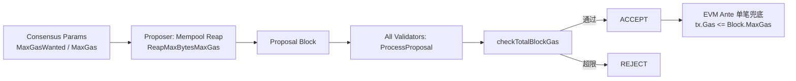
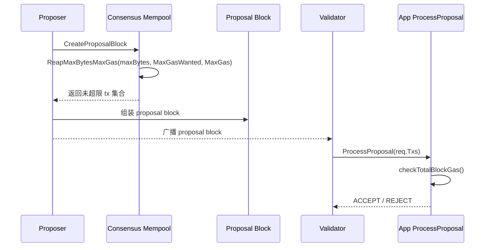
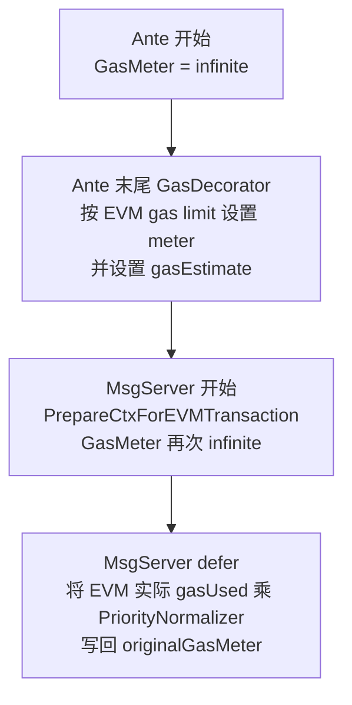
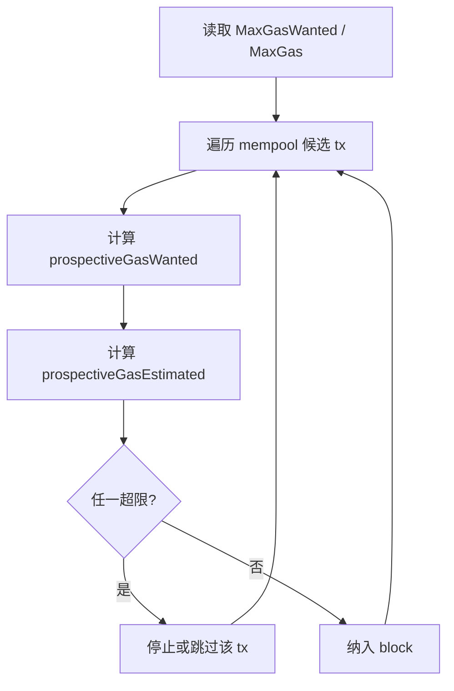
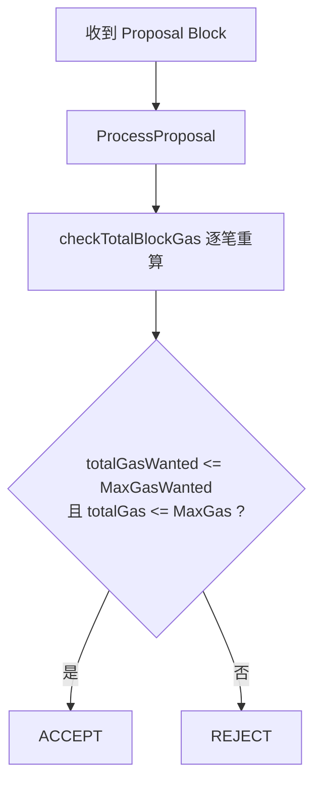

# Sei Chain 每个 Block 内 EVM Tx 总 Gas 限制与检查

本文只保留与主题直接相关的内容：Sei 如何对每个 block 中 EVM tx 的总 gas 做限制与校验。

## 1. 框架图

核心含义：

1. 第一层限制在 proposer 打包时执行。
2. 第二层限制在全网 `ProcessProposal` 重新计算后执行。
3. 第三层是 EVM ante 的单笔上限兜底。

## 2. Proposer / Validator 职责分层

这一层关系可以概括为：

1. `mempool.ReapMaxBytesMaxGas` 负责 proposer 自己打包时的前置限制。
2. `ProcessProposal -> checkTotalBlockGas` 负责验证者收到外部 proposal 后的独立复核。
3. 因此 mempool 不是最终安全边界，`ProcessProposal` 才是全网一致拒绝坏 proposal 的关键校验点。

代码核对说明：当前仓库代码中可直接确认 `checkTotalBlockGas` 由 `ProcessProposalHandler` 调用；未检索到 `SetPrepareProposalHandler` 或 `PrepareProposalHandler` 在本文件中的注册与调用。

## 3. 总 Gas 统计规则

Sei 同时维护两个区块级累计值：

$$
G_w = \sum_i gasWanted_i
$$

$$
G_t = \sum_i f(i)
$$

其中对 EVM tx：

$$
f(i)=
\begin{cases}
gasEstimate_i, & 21000 \le gasEstimate_i \le gasWanted_i \\
gasWanted_i, & otherwise
\end{cases}
$$

区块通过条件：

$$
G_w \le MaxGasWanted
\quad,\quad
G_t \le MaxGas
$$

## 4. EVM Tx 封装与 Gas 口径

EVM 交易在 Sei 中是 `MsgEVMTransaction`（`proto/evm/tx.proto`），其原始 EVM 交易数据放在 `data` 字段里。

同时，EVM tx 的 Cosmos 外层字段被要求为空（`x/evm/ante/no_cosmos_fields.go`），包括：

1. `memo`
2. `signer_infos`
3. `fee amount`
4. `signatures`

这意味着 EVM tx 的 gas 主口径来自 EVM payload（`etx.Gas()`），而不是 Cosmos 外层 fee/gas 字段。

## 5. EVM Gas 处理的 4 阶段

口径边界：

1. 区块级限制校验（`checkTotalBlockGas`）比较的是 EVM 单位的 `gasWanted/gasEstimate` 与 `MaxGasWanted/MaxGas`。
2. `PriorityNormalizer` 主要用于 DeliverTx 阶段把 EVM 实际消耗换算写入 Sei gas meter。

## 6. 打包流程（Proposer 侧）

要点：

1. proposer 在构造 block 时，就已经受双阈值约束。
2. 这一层发生在共识层，从 mempool 取交易时完成。

## 7. 验块流程（全网 ProcessProposal）

要点：

1. 这一层发生在 ABCI `ProcessProposal` 中。
2. `checkTotalBlockGas` 是执行层对 proposal tx 集合的重新累计与复核。
3. 即使 proposer 异常打包，验证节点仍会独立重算并拒绝超限 proposal。

## 8. EVM 单笔兜底

除区块总量外，EVM ante 还要求单笔满足：

$$
tx.Gas \le Block.MaxGas
$$

若超出，直接 `ErrOutOfGas`。

## 9. 关键实现位置

1. proposer 打包入口：[sei-tendermint/internal/state/execution.go](../../sei-tendermint/internal/state/execution.go)
2. mempool 双阈值限制：[sei-tendermint/internal/mempool/mempool.go](../../sei-tendermint/internal/mempool/mempool.go)
3. proposal 二次校验：[app/app.go](../../app/app.go)（函数：checkTotalBlockGas）
4. EVM 外层字段约束：[x/evm/ante/no_cosmos_fields.go](../../x/evm/ante/no_cosmos_fields.go)
5. EVM 单笔兜底：[x/evm/ante/basic.go](../../x/evm/ante/basic.go)、[app/ante/evm_checktx.go](../../app/ante/evm_checktx.go)
6. EVM gas 阶段处理：[x/evm/ante/gas.go](../../x/evm/ante/gas.go)、[x/evm/keeper/msg_server.go](../../x/evm/keeper/msg_server.go)

## 10. 引用链接

1. DeepWiki 分析页（用户提供）：[https://deepwiki.com/search/seigasevm-txgasseievm-txevm-tx_f24d3164-5f5c-4237-bdb0-9a674b5ea35b?mode=deep](https://deepwiki.com/search/seigasevm-txgasseievm-txevm-tx_f24d3164-5f5c-4237-bdb0-9a674b5ea35b?mode=deep)
2. EVM 交易消息定义：[proto/evm/tx.proto](../../proto/evm/tx.proto)
3. 区块提案创建与 ProcessProposal 调用路径：[sei-tendermint/internal/state/execution.go](../../sei-tendermint/internal/state/execution.go)
4. proposer 取交易时的 gas 限制实现：[sei-tendermint/internal/mempool/mempool.go](../../sei-tendermint/internal/mempool/mempool.go)
5. 应用层提案校验入口与总 gas 校验函数：[app/app.go](../../app/app.go)
6. EVM CheckTx 无状态校验：[app/ante/evm_checktx.go](../../app/ante/evm_checktx.go)
7. EVM ante 单笔 gas 上限校验：[x/evm/ante/basic.go](../../x/evm/ante/basic.go)
8. EVM 外层 Cosmos 字段为空约束：[x/evm/ante/no_cosmos_fields.go](../../x/evm/ante/no_cosmos_fields.go)
9. EVM gas decorator（gas limit 与 estimate 处理）：[x/evm/ante/gas.go](../../x/evm/ante/gas.go)
10. MsgServer 内 gas meter 切换与 gasUsed 写回：[x/evm/keeper/msg_server.go](../../x/evm/keeper/msg_server.go)