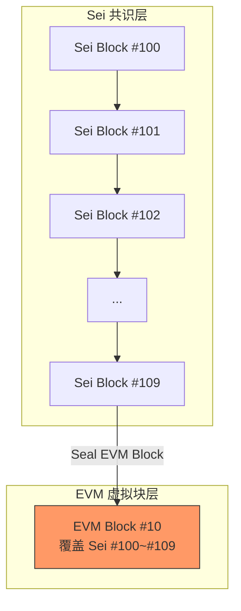
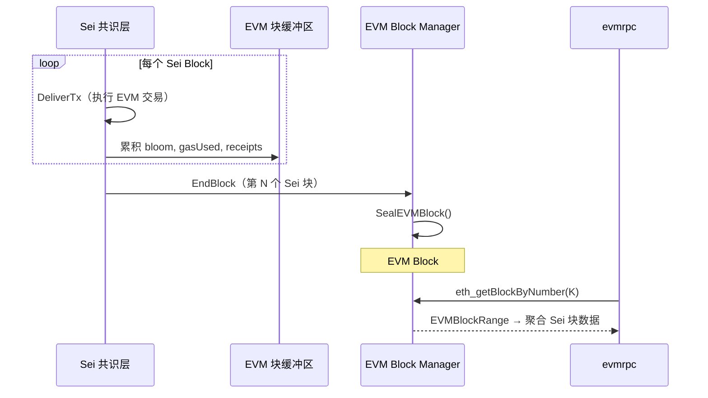
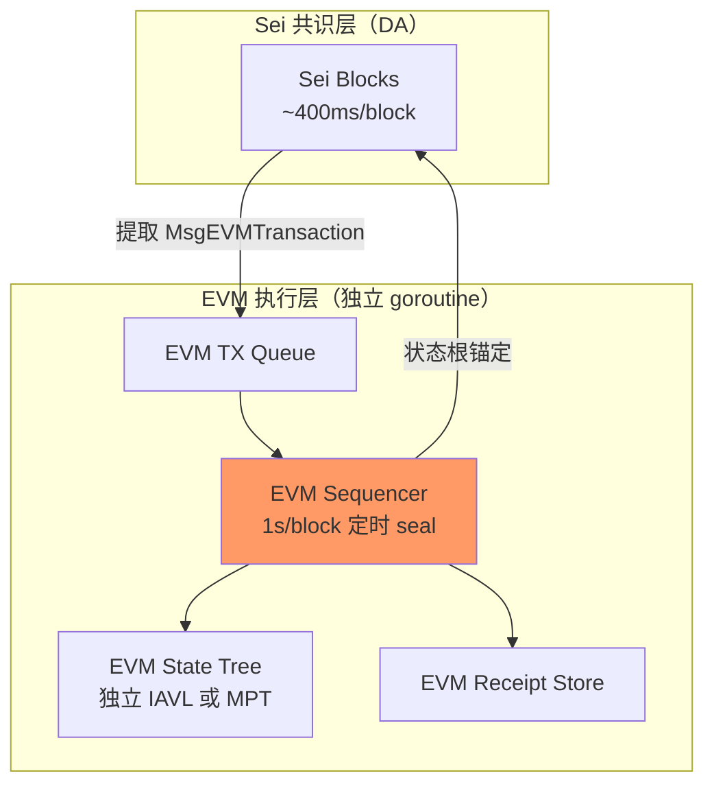
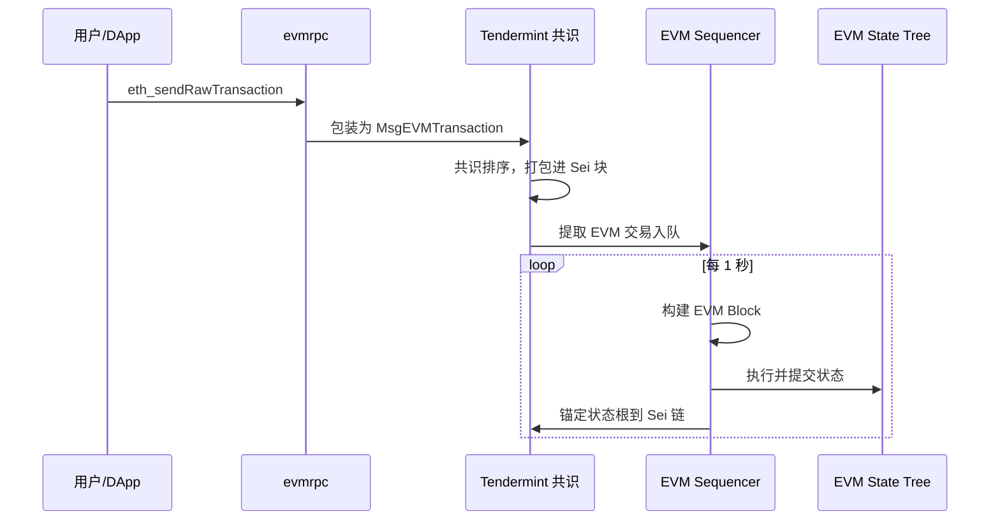

# EVM Block 独立出块方案设计

> 相关文档：[功能概览](evm-overview.md) | [交易生命周期](evm-tx-lifecycle.md) | [存储与查询架构](evm-storage-query.md)
>
> 参考：[DeepWiki: sei-chain EVM](https://deepwiki.com/search/seichainevm_2d0b56ca-db3b-40cd-811d-8fae3712e850)

## 1. 问题定义

当前 sei-chain 中 **EVM block number ≡ Tendermint block height**，两者完全绑定。本文探讨将 EVM 块高度序列独立出来的可行性与实现方案，包括：

- **聚合模式**：每 N 个 Sei 块产生 1 个 EVM 块（降频）
- **独立节奏模式**：EVM 以固定时间间隔（如 1s）独立出块

---

## 2. 现状分析：耦合点全景

代码库中 `EVM block number === ctx.BlockHeight()` 的假设硬编码在以下 10 个核心位置：

### 2.1 EVM 执行上下文

**文件**：`x/evm/keeper/keeper.go` — `GetVMBlockContext()`

```go
return &vm.BlockContext{
    BlockNumber: big.NewInt(ctx.BlockHeight()),  // ← 直接映射
    Time:        uint64(ctx.BlockHeader().Time.Unix()),
    BaseFee:     baseFee,
    // ...
}
```

Solidity 中 `block.number` 的返回值直接来自 `ctx.BlockHeight()`。

### 2.2 块哈希查询

**文件**：`x/evm/keeper/keeper.go` — `GetHashFn()`

```go
func (k *Keeper) GetHashFn(ctx sdk.Context) vm.GetHashFunc {
    return func(height uint64) common.Hash {
        h := int64(height)
        if ctx.BlockHeight() == h {
            return common.BytesToHash(ctx.HeaderHash())
        }
        if ctx.BlockHeight() < h {
            return common.Hash{}
        }
        return k.getHistoricalHash(ctx, h)
    }
}
```

`blockhash(N)` 操作码按 Tendermint 高度索引历史哈希。

### 2.3 Receipt 写入

**文件**：`x/evm/keeper/receipt.go` — `WriteReceipt()`

```go
receipt := &types.Receipt{
    BlockNumber:      uint64(ctx.BlockHeight()),  // ← 直接映射
    TransactionIndex: uint32(ctx.TxIndex()),
    // ...
}
```

每个 receipt 的 `BlockNumber` 字段等于当前 Sei 高度。

### 2.4 EndBlock 收据校验

**文件**：`x/evm/keeper/abci.go` — `EndBlock()`

```go
if r.TxType == types.ShellEVMTxType || r.BlockNumber != uint64(ctx.BlockHeight()) {
    continue
}
```

EndBlock 中验证 receipt 的 BlockNumber 是否与当前 Sei 块高度一致。

### 2.5 BlockBloom 存储

**文件**：`x/evm/keeper/log.go`

```go
func (k *Keeper) SetBlockBloom(ctx sdk.Context, blooms []ethtypes.Bloom) {
    store := ctx.KVStore(k.storeKey)
    store.Set(types.BlockBloomPrefix, BloomsToBytes(blooms))
}

func (k *Keeper) GetLegacyBlockBloom(ctx sdk.Context, height int64) (res ethtypes.Bloom) {
    store := ctx.KVStore(k.storeKey)
    bz := store.Get(types.BlockBloomKey(height))  // ← 按 Sei 高度索引
    // ...
}
```

Bloom 过滤器按 `BlockBloomKey(height)` 存储，其中 height 即 `ctx.BlockHeight()`。

### 2.6 BaseFee 调整

**文件**：`x/evm/keeper/abci.go`

```go
newBaseFee := k.AdjustDynamicBaseFeePerGas(ctx, uint64(blockGasUsed))
```

基础费用在**每个 Sei 块**的 EndBlock 中调整一次。

### 2.7 块编码（RPC 层）

**文件**：`evmrpc/block.go` — `EncodeTmBlock()`

```go
number := big.NewInt(block.Block.Height)  // ← EVM 块号 = Tendermint 高度
```

JSON-RPC 返回的以太坊格式块号直接取 Tendermint Block.Height。

### 2.8 eth_blockNumber 端点

**文件**：`evmrpc/info.go`

```go
func (i *InfoAPI) BlockNumber() hexutil.Uint64 {
    height, err := i.latestHeight(context.Background())
    if err != nil {
        height = i.ctxProvider(LatestCtxHeight).BlockHeight()
    }
    return hexutil.Uint64(height)  // ← 返回 Tendermint 高度
}
```

### 2.9 WatermarkManager

**文件**：`evmrpc/watermark_manager.go`

```go
func (m *WatermarkManager) ResolveHeight(ctx context.Context, blockNrOrHash rpc.BlockNumberOrHash) (int64, error) {
    // 块号参数被视为 Tendermint 高度
    res, err := blockByHash(ctx, m.tmClient, blockNrOrHash.BlockHash[:])
    height := res.Block.Height  // ← 返回 Tendermint 高度
    return height, nil
}
```

三端（Tendermint Block Store、Cosmos State、Receipt Store）取最小 Sei 高度作为安全查询上界。

### 2.10 日志过滤

**文件**：`evmrpc/filter.go`

`eth_getLogs` 的块范围参数直接映射为 Tendermint 高度范围进行遍历查询。

### 2.11 交易过滤（filterTransactions）

**文件**：`evmrpc/utils.go` — `filterTransactions()`

```go
receipt.BlockNumber != uint64(block.Block.Height)
```

用于过滤无效 receipt，直接将 receipt 的 BlockNumber 与 Tendermint block Height 比较。

### 耦合点汇总

| 耦合点 | 文件 | 关键假设 |
|--------|------|---------|
| EVM 执行上下文 | `x/evm/keeper/keeper.go` | `vm.BlockNumber == ctx.BlockHeight()` |
| 块哈希查询 | `x/evm/keeper/keeper.go` | `blockhash(N)` 按 Sei 高度索引 |
| Receipt 写入 | `x/evm/keeper/receipt.go` | `receipt.BlockNumber == ctx.BlockHeight()` |
| EndBlock 校验 | `x/evm/keeper/abci.go` | receipt 块号 = 当前 Sei 高度 |
| Bloom 存储 | `x/evm/keeper/log.go` | `BlockBloomKey(seiHeight)` |
| BaseFee 调整 | `x/evm/keeper/abci.go` | 每 Sei 块调整一次 |
| 块编码 | `evmrpc/block.go` | `block.Number == Block.Height` |
| eth_blockNumber | `evmrpc/info.go` | 返回 Tendermint 高度 |
| WatermarkManager | `evmrpc/watermark_manager.go` | 块号 = Sei 高度 |
| 日志过滤 | `evmrpc/filter.go` | 块范围 = Sei 高度范围 |
| 交易过滤 | `evmrpc/utils.go` | `receipt.BlockNumber == block.Block.Height` |

---

## 3. 方案一：聚合模式（N Sei Block → 1 EVM Block）

每 N 个 Sei 块产生 1 个 EVM 块。EVM 交易仍在 Cosmos DeliverTx 中执行，"EVM 块"变成跨越多个 Sei 块的虚拟聚合概念。



### 3.1 新增 EVM Block Manager

在 `x/evm/keeper/` 中新增 block manager，管理 EVM 块号及双向映射：

**新增 KV Store 前缀**（`x/evm/types/keys.go`）：

```go
var (
    EVMBlockNumberKey     = []byte{0x20} // 当前 EVM 块号
    EVMBlockMappingPrefix = []byte{0x21} // EVMBlockNum → (startSeiHeight, endSeiHeight)
    SeiToEVMBlockPrefix   = []byte{0x22} // SeiHeight → EVMBlockNum
)
```

**核心数据结构与方法**：

```go
type EVMBlockRange struct {
    StartSeiHeight int64
    EndSeiHeight   int64
    Timestamp      int64  // seal 时刻（最后一个 Sei 块的时间戳）
    BlockHash      []byte // 最后一个 Sei 块的哈希
}

// 查询当前 EVM 块号
func (k *Keeper) GetCurrentEVMBlockNumber(ctx sdk.Context) uint64

// 判断是否应 seal 一个 EVM 块（如 ctx.BlockHeight() % interval == 0）
func (k *Keeper) ShouldSealEVMBlock(ctx sdk.Context) bool

// 递增 EVM 块号，写入双向映射
func (k *Keeper) SealEVMBlock(ctx sdk.Context) uint64

// 双向查询
func (k *Keeper) SeiHeightToEVMBlock(ctx sdk.Context, h int64) uint64
func (k *Keeper) EVMBlockToSeiRange(ctx sdk.Context, evmBlock uint64) EVMBlockRange
```

### 3.2 修改 EndBlock

```go
func (k *Keeper) EndBlock(ctx sdk.Context, height int64, blockGasUsed int64) {
    // ... 现有逻辑（surplus 收集、deferred info 处理等）不变 ...

    // 累积到 EVM 块级缓冲区（不立即 finalize）
    k.AccumulateBlockBloom(ctx, allBlooms)
    k.AccumulateBlockGasUsed(ctx, blockGasUsed)

    // 判断是否 seal EVM 块
    if k.ShouldSealEVMBlock(ctx) {
        evmBlockNum := k.SealEVMBlock(ctx)

        // 合并并写入最终 bloom
        mergedBloom := k.FlushAccumulatedBloom(ctx)
        k.SetEVMBlockBloom(ctx, evmBlockNum, mergedBloom)

        // BaseFee 调整移到 EVM 块粒度
        totalGas := k.FlushAccumulatedGasUsed(ctx)
        k.AdjustDynamicBaseFeePerGas(ctx, totalGas)
    }
}
```

### 3.3 修改 Receipt 写入

```go
func (k *Keeper) WriteReceipt(ctx sdk.Context, ...) (*types.Receipt, error) {
    receipt := &types.Receipt{
        BlockNumber: k.GetCurrentEVMBlockNumber(ctx), // ← 使用 EVM 块号
        // ...
    }
}
```

### 3.4 修改 EVM 执行上下文

```go
func (k *Keeper) GetVMBlockContext(ctx sdk.Context, gp core.GasPool) (*vm.BlockContext, error) {
    return &vm.BlockContext{
        BlockNumber: big.NewInt(int64(k.GetCurrentEVMBlockNumber(ctx))), // ← EVM 块号
        Time:        uint64(ctx.BlockHeader().Time.Unix()),              // 时间戳保持精确
        // ...
    }, nil
}
```

**影响**：Solidity 中 `block.number` 返回 EVM 块号而非 Sei 高度。同一个 EVM 块内多个 Sei 块执行时 `block.number` 值相同。

### 3.5 修改 GetHashFn

```go
func (k *Keeper) GetHashFn(ctx sdk.Context) vm.GetHashFunc {
    return func(evmBlockNum uint64) common.Hash {
        r := k.EVMBlockToSeiRange(ctx, evmBlockNum)
        if r.EndSeiHeight == 0 {
            return common.Hash{}
        }
        // 返回 EVM 块对应的最后一个 Sei 块的哈希
        return k.getHistoricalHash(ctx, r.EndSeiHeight)
    }
}
```

### 3.6 修改 evmrpc 层

**块编码** — `EncodeTmBlock` → `EncodeEVMBlock`：

```go
func EncodeEVMBlock(evmBlockNum uint64, seiRange EVMBlockRange, ...) map[string]interface{} {
    // 聚合 seiRange 内所有 Sei 块的交易
    allTxs := []interface{}{}
    totalGasUsed := uint64(0)
    for h := seiRange.StartSeiHeight; h <= seiRange.EndSeiHeight; h++ {
        block := tmClient.Block(h)
        // 收集该 Sei 块中的 EVM 交易...
    }
    return map[string]interface{}{
        "number":    hexutil.Uint64(evmBlockNum),
        "hash":      hashOfLastSeiBlock,
        "timestamp": hexutil.Uint64(seiRange.Timestamp),
        "gasUsed":   hexutil.Uint64(totalGasUsed),
        // ...
    }
}
```

**eth_getBlockByNumber(N)**：
1. 通过映射表查 `EVMBlock N → (startSei, endSei)`
2. 遍历 `startSei..endSei` 的所有 Sei 块，聚合交易
3. 返回合成的 EVM 块

**eth_blockNumber**：

```go
func (i *InfoAPI) BlockNumber() hexutil.Uint64 {
    return hexutil.Uint64(k.GetCurrentEVMBlockNumber(latestCtx))
}
```

**WatermarkManager**：取三端最小 Sei 高度后，通过映射转换为 EVM 块号。

### 3.7 数据流总览



### 3.8 关键考量

| 问题 | 解决方案 |
|------|---------|
| **seal 前 receipt 的 BlockNumber？** | 使用"下一个 EVM 块号"（tentative），seal 后值不变 |
| **同 EVM 块内 `block.number` 相同** | 是的，这是预期行为；`block.timestamp` 仍随 Sei 块精确变化 |
| **跨 EVM 块的状态可见性** | Cosmos 状态仍每 Sei 块提交，EVM 块号只是逻辑分组 |
| **`block.timestamp` 语义** | 可选：当前 Sei 块时间（精确）或 EVM 块 seal 时间（聚合） |
| **历史数据兼容** | 升级前 `EVMBlock == SeiHeight`；升级高度后开始独立编号，需写入初始映射 |
| **改动范围** | ~8-10 个文件：keeper（新增 block manager + 改 abci/receipt/keeper）、evmrpc（块编码 + watermark + info） |

---

## 4. 方案二：独立节奏模式（EVM 固定时间间隔出块）

EVM 以固定时间间隔（如 1s）独立出块，与 Sei 共识层出块节奏解耦。本质上是一个 **L2 Sequencer** 架构。



### 4.1 核心组件

```go
type EVMSequencer struct {
    ticker       *time.Ticker              // 固定间隔定时器（如 1s）
    pendingTxs   []*types.MsgEVMTransaction
    stateDB      *state.DBImpl             // 独立状态树
    evmBlockNum  uint64
    mu           sync.Mutex
}

func (s *EVMSequencer) Run() {
    for range s.ticker.C {
        s.mu.Lock()
        txs := s.pendingTxs
        s.pendingTxs = nil
        s.mu.Unlock()

        block := s.buildEVMBlock(txs)
        results := s.executeBlock(block)
        s.commitState(results)
        s.evmBlockNum++
    }
}
```

### 4.2 交易流转



### 4.3 关键挑战

| 挑战 | 说明 | 难度 |
|------|------|------|
| **双状态树同步** | EVM 状态独立提交，需与 Cosmos Bank 模块余额保持一致 | 极高 |
| **Precompile 困境** | Sei precompile（staking/bank/wasm）直接操作 Cosmos 状态，EVM 和 Cosmos 异步执行时读到的状态可能不一致 | 极高 |
| **Revert 语义** | EVM 块 revert 但 Sei 块已提交时如何回滚 | 高 |
| **交易排序** | 谁决定 EVM 交易在 EVM 块内的排序？需要独立的排序逻辑 | 中 |
| **空块处理** | Sei 块间可能产生多个空 EVM 块 | 低 |
| **最终性** | EVM 块的最终性何时确定？需定期锚定到 Sei 链 | 高 |

---

## 5. 两种方案对比

| 维度 | 聚合模式（方案一） | 独立节奏模式（方案二） |
|------|-------------------|----------------------|
| **EVM 块频率** | 低于 Sei（N:1） | 任意（可快可慢） |
| **执行时机** | 仍在 DeliverTx 中 | 独立 goroutine 定时执行 |
| **状态树** | 共用 Cosmos IAVL | 需要独立状态树（MPT 或独立 IAVL） |
| **共识** | 交易排序仍由 Tendermint 决定 | 需要自己的排序逻辑（sequencer） |
| **状态最终性** | 与 Sei 块同步提交 | 需要定期锚定到 Sei 链 |
| **空块** | 不存在 | 可能产生 |
| **Precompile 兼容** | 完全兼容 | 存在跨状态树一致性问题 |
| **实现复杂度** | **中等**（改映射 + RPC 适配） | **极高**（独立执行引擎 + 状态同步） |
| **对 DApp 的影响** | `block.number` 递增变慢 | `block.number` 按固定节奏递增 |
| **数据一致性** | 天然一致 | 需要 2PC 或 anchor 机制 |
| **改动文件** | ~8-10 个文件 | 架构级重构，涉及 20+ 文件 |

---

## 6. 推荐

| 需求场景 | 推荐方案 |
|---------|---------|
| 降低 EVM 块频率（如 1 EVM / 10 Sei） | **方案一（聚合模式）**，改动可控，风险低 |
| EVM 块频率独立于 Sei | **方案二（独立节奏）**，但建议重新评估架构定位，接近 rollup |
| EVM 块频率快于 Sei | 当前架构不可能实现，需要 L2 sequencer 架构 |

**方案一**是渐进式改进，保持了 Sei 链的核心架构不变，只在逻辑层面引入 EVM 块号的独立管理。**方案二**实质上是将 Sei 链从"嵌入式 EVM"架构转变为"EVM L2 + Sei DA"架构，属于架构级重构。
