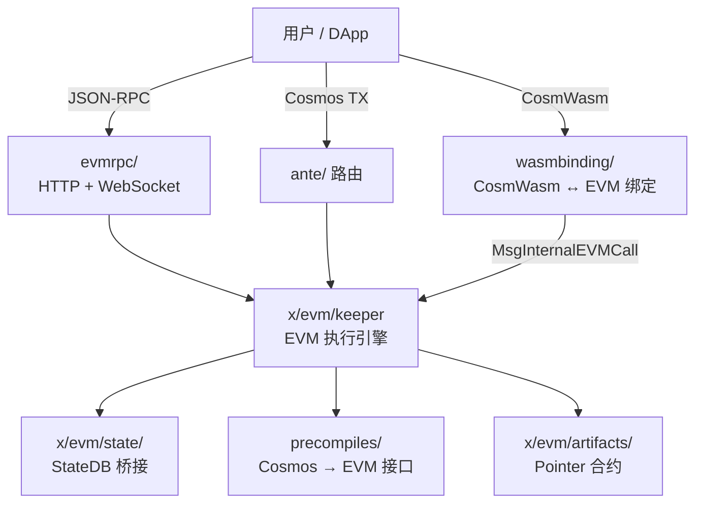
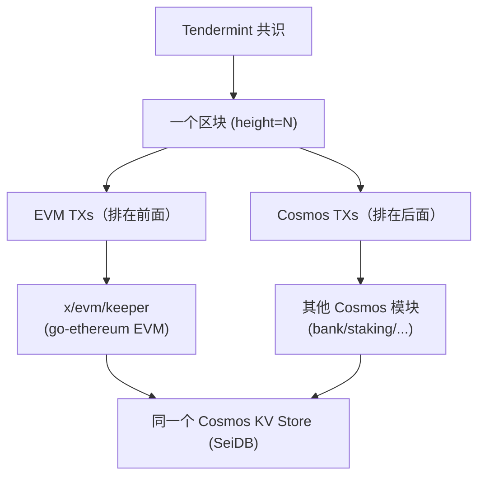

# Sei Chain EVM 功能概览

Sei 的 EVM 是**深度集成**方案——在 Cosmos SDK 存储层上运行 go-ethereum 的 EVM 解释器，实现 CosmWasm 与 EVM 的完全互操作。

> 相关文档：[交易生命周期](evm-tx-lifecycle.md) | [存储与查询架构](evm-storage-query.md)
>
> 参考：[DeepWiki: sei-chain EVM](https://deepwiki.com/search/seichainevm_2d0b56ca-db3b-40cd-811d-8fae3712e850)

## 架构简图

---

## 1. EVM Block 与 Sei Chain Block 的关系

EVM **不是**独立的链或独立的区块生产者，它只是 Cosmos SDK 模块中嵌入的执行引擎。EVM block 和 Sei chain block 是**同一个东西**。

| 维度 | 说明 |
|------|------|
| **区块高度** | EVM block number **等于** Tendermint block height，一一对应 |
| **区块哈希** | EVM block hash **等于** Tendermint BlockID.Hash |
| **出块节奏** | 完全跟随 Tendermint 共识出块，没有独立的 EVM 出块周期 |
| **区块存储** | EVM 没有独立的区块存储，查询时从 Tendermint 区块实时转换 |
| **交易排序** | EVM TX 和 Cosmos TX 在同一个 Tendermint 区块中排序（EVM TX 排在前面） |

- **一个共识**：Tendermint/CometBFT
- **一个区块序列**：Tendermint blocks，EVM 和 Cosmos 交易混在同一个区块中
- **一个出块节奏**：Tendermint 的出块间隔（Sei 主网约 400ms）
- **一个状态树**：所有模块共享 SeiDB，EVM 状态只是其中 store key = `"evm"` 的一个子树

> **pacific-1 主网**：EVM 功能在 block **79123881** 激活。`ValidateEVMBlockHeight` 会拒绝查询该高度以下的 EVM 区块。EVM 块号不会从 0 重新计数——"EVM 创世块"就是 Sei 的第 79123881 块。

---

## 2. `x/evm/` — EVM 核心模块

Cosmos SDK 的 EVM 模块，将完整的以太坊虚拟机集成到 Sei 链中。

### 核心子包

| 子包 | 说明 |
|------|------|
| `keeper/` | EVM 执行引擎、地址管理、余额、nonce、receipt、pointer 合约、fee 管理（40+ 文件） |
| `state/` | 在 Cosmos store 上实现 go-ethereum 的 `StateDB` 接口（usei/wei 双精度余额、snapshot/revert、journal、transient storage） |
| `types/` | Protobuf 消息（`MsgEVMTransaction`、`MsgInternalEVMCall` 等）、参数、错误码、key 定义、链配置 |
| `types/ethtx/` | 以太坊交易类型（Legacy、EIP-2930 AccessList、EIP-1559 DynamicFee、EIP-7702 SetCode） |
| `ante/` | EVM 专用 ante handler 链（路由、签名验证、nonce 校验、fee 验证、gas 计量、Cosmos 字段拒绝等） |
| `artifacts/` | 内嵌 pointer 合约字节码（CW20/CW721/CW1155/ERC20/ERC721/ERC1155/native/wsei） |
| `migrations/` | 存储迁移（base fee、EIP-1559 参数、bloom、pointer 升级等，15+ 迁移） |
| `config/` | EVM 链配置（ChainConfig、硬分叉参数） |
| `derived/` | 派生数据结构 |
| `querier/` | gRPC 查询服务 |
| `replay/` | 以太坊区块重放配置 |
| `blocktest/` | 以太坊 blocktest 测试框架配置 |
| `client/` | CLI 与 WASM 绑定 |

### 核心特性

- **双地址模型**：Sei (bech32) ↔ EVM (hex) 双向映射，支持显式关联和默认 cast 地址
- **支持的交易类型**：Legacy、EIP-2930、EIP-1559、EIP-7702 (SetCode)、Associate（Sei 专有）
- **EIP-1559 动态 base fee**：逐块根据 gas 使用量调整
- **Pointer 合约**：CW20↔ERC20、CW721↔ERC721、CW1155↔ERC1155 双向互操作
- **Deferred processing**：bloom filter、fee surplus、错误 receipt 在 EndBlock 汇总
- **Synthetic receipts**：跨 CW/EVM 调用产生的合成 receipt 和日志

---

## 3. `evmrpc/` — EVM JSON-RPC 服务

实现以太坊兼容的 JSON-RPC API 服务器（HTTP + WebSocket）。

### 关键文件

| 文件 | 说明 |
|------|------|
| `server.go` | HTTP/WS 服务器初始化，注册所有 RPC namespace |
| `block.go` | `eth_getBlockBy*` 系列 |
| `tx.go` | `eth_getTransaction*`、`eth_getTransactionReceipt` |
| `send.go` | `eth_sendRawTransaction` |
| `filter.go` | `eth_getLogs`、`eth_newFilter` 等日志过滤 |
| `state.go` | `eth_getBalance`、`eth_getCode`、`eth_getStorageAt` |
| `simulate.go` | `eth_call`、`eth_estimateGas` |
| `tracers.go` | `debug_traceTransaction`、`debug_traceBlockByNumber` 等 |
| `subscribe.go` | WebSocket 订阅（`eth_subscribe`） |
| `bloom.go` | Bloom filter 相关 |
| `association.go` | Sei/EVM 地址关联查询 |
| `info.go` | `eth_chainId`、`eth_gasPrice` 等 |
| `txpool.go` | `txpool_*` 端点 |
| `net.go` | `net_*` 端点 |
| `web3.go` | `web3_*` 端点 |
| `sei_legacy.go` | `sei_*`/`sei2_*` 旧版端点（含 Cosmos 交易可见性） |
| `worker_pool.go` | RPC 请求的 worker pool 并发控制 |
| `watermark_manager.go` | 区块高度可用性管理 |
| `config/` | RPC 服务器配置（端口、超时、worker 池大小） |
| `stats/` | RPC 调用追踪统计 |

### 关键特性

- **即时最终性**：无 `pending` 概念，`pending` 等同于 `latest`
- **三个 RPC 命名空间**：
  - `eth`：标准以太坊 JSON-RPC（默认）
  - `sei`：扩展命名空间，可见 EVM + Cosmos synthetic receipt 交易
  - `sei2`：扩展命名空间，区块中额外包含 bank transfer
- **Legacy API 网关**：通过 `app.toml` 白名单控制，已标记为废弃
- **Debug tracing**：忠实重放历史执行
- **不支持**：uncle/trie/PoW/blob 等以太坊特性

---

## 4. `precompiles/` — EVM 预编译合约

将 Cosmos SDK 原生功能暴露给 EVM 调用者。每个预编译都有 Solidity 接口、ABI 定义、Go 实现和版本控制。

### 注册的预编译

| 预编译 | 路径 | 地址 | 说明 |
|--------|------|------|------|
| **Bank** | `precompiles/bank/` | `0x...1001` | EVM 中访问 Cosmos bank 模块（转账、余额查询） |
| **Staking** | `precompiles/staking/` | `0x...1005` | EVM 中质押/解质押/重委托操作 |
| **Gov** | `precompiles/gov/` | `0x...1006` | EVM 中提案投票 |
| **Distribution** | `precompiles/distribution/` | `0x...1007` | EVM 中领取质押奖励 |
| **Oracle** | `precompiles/oracle/` | `0x...1008` | EVM 中查询预言机数据 |
| **IBC** | `precompiles/ibc/` | `0x...1009` | EVM 中发起 IBC 跨链转账 |
| **Wasmd** | `precompiles/wasmd/` | `0x...1002` | EVM 中调用 CosmWasm 合约 |
| **JSON** | `precompiles/json/` | `0x...1003` | EVM 中的 JSON 解析工具 |
| **Addr** | `precompiles/addr/` | `0x...1004` | Sei ↔ EVM 地址转换 |
| **Pointer** | `precompiles/pointer/` | `0x...100B` | 注册/管理 pointer 合约 |
| **PointerView** | `precompiles/pointerview/` | — | 查询 pointer 合约信息 |
| **P256** | `precompiles/p256/` | — | P-256 (secp256r1) 签名验证 |
| **Solo** | `precompiles/solo/` | — | Solo 预编译 |

### 架构模式

- 统一基类 `precompiles/common/precompiles.go` 实现 `vm.PrecompiledContract`
- `precompiles/setup.go` 负责所有预编译的初始化和注册
- `precompiles/utils/expected_keepers.go` 定义 keeper 接口
- 每个预编译通过 `GetVersioned()` 支持按区块高度分版本

---

## 5. `app/` 中的 EVM 集成

| 文件 | 说明 |
|------|------|
| `app/precompiles.go` | `PrecompileKeepers` 结构体——将所有 Cosmos keeper 包装为预编译所需的接口 |
| `app/eth_replay.go` | 以太坊区块重放引擎——从以太坊主网拉取区块并在 Sei 上重放执行，逐交易验证余额和状态 |
| `app/abci.go` | ABCI 层 EVM 交易处理——提取 EVM nonce/sender/txhash，构建 `EvmTxInfo` |
| `app/ante.go` | Ante handler 路由——区分 EVM 和 Cosmos 交易走不同处理链 |
| `app/receipt.go` | Receipt 处理和存储 |

---

## 6. 其他 EVM 相关

| 路径 | 说明 |
|------|------|
| `contracts/` | Hardhat 项目——EVM 合约源码、测试、部署脚本 |
| `integration_test/evm_module/` | EVM 模块集成测试 |
| `wasmbinding/` | CosmWasm ↔ EVM 绑定（查询和消息） |
