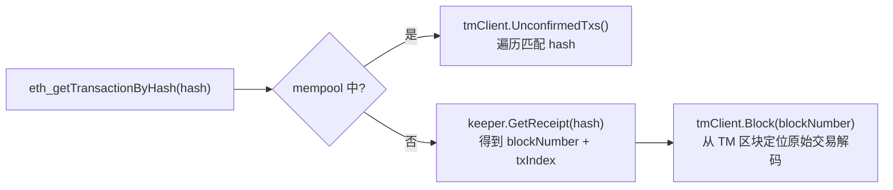
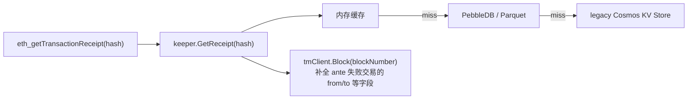
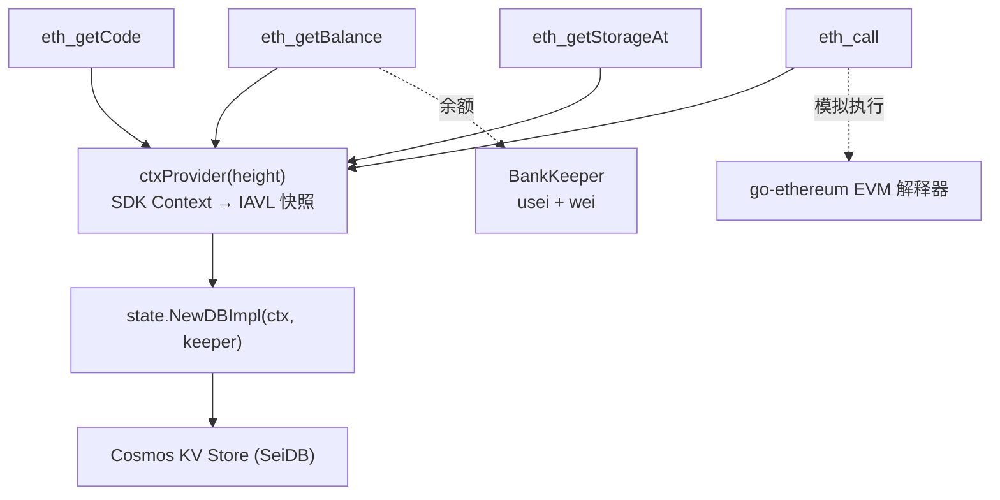
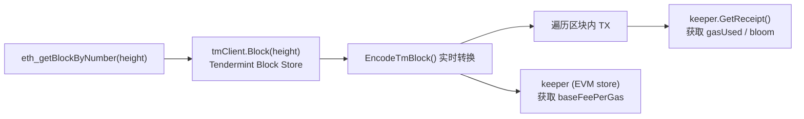

# EVM 存储与查询架构

> 相关文档：[功能概览](evm-overview.md) | [交易生命周期](evm-tx-lifecycle.md)

## 1. EVM 数据存储架构

### 1.1 EVM Transaction — Tendermint Block Store

EVM 交易作为 `MsgEVMTransaction`（Cosmos TX）存储在 **Tendermint Block Store** 中，**不独立存储**。查询交易时通过 receipt 中的 txHash 定位到 Tendermint 区块中的原始交易。

### 1.2 EVM Chain State — Cosmos KV Store

所有 EVM 链状态存储在 EVM 模块的 Cosmos KV Store（store key = `"evm"`）中。前缀定义在 `x/evm/types/keys.go`：

| 前缀 | 数据 | Key 格式 | Value |
|------|------|---------|-------|
| `0x01` | EVM→Sei 地址映射 | `evmAddr (20B)` | Sei bech32 地址 bytes |
| `0x02` | Sei→EVM 地址映射 | `seiAddr` | EVM 地址 (20B) |
| `0x03` | 合约存储槽 | `address (20B) + slotHash (32B)` | value (32B) |
| `0x07` | 合约字节码 | `address (20B)` | 原始字节码 |
| `0x08` | 代码哈希 | `address (20B)` | keccak256 hash (32B) |
| `0x09` | 代码大小 | `address (20B)` | uint64 (8B) |
| `0x0a` | Nonce | `address (20B)` | uint64 (8B) |
| `0x0d` | BlockBloom | 覆盖式写入 | 当前块合并 bloom |
| `0x15` | Pointer 注册 | ERC20/721/1155 | pointer 合约地址 |
| `0x1b` | BaseFeePerGas | — | 当前基础费 |
| `0x1c` | NextBaseFeePerGas | — | 下一块基础费 |

**余额例外**：余额**不在 EVM store 中**，而是通过 **Bank 模块**存储，采用双精度设计：

- `usei`（6 位小数）：Cosmos 原生，存在 Bank 模块
- `wei`（额外 12 位小数）：`1 usei = 10^12 swei`，通过 BankKeeper 扩展方法管理
- 对外展示 18 位小数（swei），兼容以太坊应用

**桥接层**：`x/evm/state/DBImpl` 实现了 go-ethereum 的 `vm.StateDB` 接口，将 EVM 读写映射到上述 Cosmos KV Store。

### 1.3 EVM Block — 不独立存储，实时派生

EVM 区块**没有独立存储**。JSON-RPC 返回的以太坊格式区块由 `evmrpc/block.go` 从 Tendermint 区块实时转换：

| EVM 字段 | 来源 |
|---------|------|
| `number` | `block.Block.Height` |
| `hash` | Tendermint `BlockID.Hash` |
| `parentHash` | `Block.LastBlockID.Hash` |
| `miner` | `Block.ProposerAddress` |
| `timestamp` | `Block.Time` |
| `baseFeePerGas` | EVM store `0x1c` |
| `gasUsed` | 累计各 receipt 的 GasUsed |
| `logsBloom` | EVM store `0x0d` (块级合并 bloom) |
| `difficulty/nonce/uncles` | 固定为空值（不适用） |

唯一持久化的区块级数据是 **BlockBloom**（前缀 `0x0d`），存在 EVM KV Store 中。

### 1.4 EVM TX Receipt — 独立 Receipt Store

Receipt 存储最复杂，分三层架构：

```
┌────────────────────────────────────────────┐
│  Layer 1: Transient Store（块内临时）         │
│  交易执行后 WriteReceipt → SetTransientReceipt │
│  生命周期：单个区块内                           │
├────────────────────────────────────────────┤
│  Layer 2: 内存缓存（cachedReceiptStore）      │
│  最近数百块的 receipt                         │
├────────────────────────────────────────────┤
│  Layer 3: 持久化 Receipt Store               │
│  后端：PebbleDB（默认）或 Parquet             │
│  目录：{home}/data/receipt.db               │
│  Key：ReceiptKeyPrefix(0x0b) + txHash       │
└────────────────────────────────────────────┘
```

**Receipt 生命周期**：

1. **交易执行时** → `SetTransientReceipt()` 写入 transient store
2. **EndBlock** → `FlushTransientReceipts()` 遍历 transient store，批量写入持久化 Receipt Store
3. **查询时** → 内存缓存 → PebbleDB/Parquet → fallback 到 legacy Cosmos KV Store

### 1.5 存储总结

| 数据 | 存储位置 | 独立 DB？ |
|------|---------|----------|
| **EVM Transaction** | Tendermint Block Store（作为 Cosmos TX） | 否 |
| **EVM Chain State** | Cosmos KV Store（`"evm"` module），余额在 Bank 模块 | 否 |
| **EVM Block** | 不存储，从 Tendermint 区块实时派生 | — |
| **EVM TX Receipt** | 独立 Receipt Store（PebbleDB/Parquet） | **是**，`data/receipt.db` |

---

## 2. evmrpc 查询架构

### 2.1 evmrpc 不是独立进程

evmrpc HTTP/WS 服务器运行在 **seid 进程内部**，通过 goroutine 启动，直接共享进程内的 keeper、Tendermint 客户端、Cosmos 状态等对象，**不经过任何网络调用**。

启动链路：`seid` 启动 → `App.RegisterTendermintService()` → `evmrpc.NewEVMHTTPServer()` → 等待第一个区块 EndBlock 信号后开始监听 8545 端口。

核心依赖注入：

| 参数 | 类型 | 作用 |
|------|------|------|
| `tmClient` | `rpcclient.Client` | Tendermint RPC 客户端（进程内调用） |
| `keeper` | `*keeper.Keeper` | EVM keeper，直接内存访问 |
| `ctxProvider` | `func(int64) sdk.Context` | 按高度获取 SDK 上下文 |
| `app` | `*baseapp.BaseApp` | 用于 DeliverTx 重放 |
| `stateStore` | `types.StateStore` | SeiDB 状态存储 |

### 2.2 ctxProvider 机制

`ctxProvider` 是统一的状态访问抽象，传入区块高度，返回指向对应 IAVL 快照的 `sdk.Context`：

- **`height = -1`（latest）**：返回 CheckTx 上下文（最新已提交状态）
- **具体高度**：调用 `app.CreateQueryContext(height, false)`，创建指向该历史高度的只读快照上下文

### 2.3 查询 EVM Transaction（`eth_getTransactionByHash`）



**数据源**：Receipt Store（定位交易位置）+ Tendermint Block Store（获取原始交易数据），都是进程内直接访问。

### 2.4 查询 EVM TX Receipt（`eth_getTransactionReceipt`）



**数据源**：Receipt Store（主要）+ Tendermint Block Store（补全信息）。

### 2.5 查询 EVM Chain State（`eth_getBalance` / `eth_getCode` / `eth_getStorageAt` / `eth_call`）



**数据源**：全部通过 Cosmos KV Store（SeiDB/IAVL），`ctxProvider` 提供对应高度的快照上下文。`eth_call` 额外调用 go-ethereum 的 EVM 解释器做模拟执行。

### 2.6 查询 EVM Block（`eth_getBlockByNumber` / `eth_getBlockByHash`）



**字段映射**：`number` ← Block.Height, `hash` ← BlockID.Hash, `miner` ← ProposerAddress, `baseFeePerGas` ← EVM store `0x1c`, `gasUsed` ← 累计 receipt.GasUsed, `logsBloom` ← OR 合并各 receipt bloom。

### 2.7 高度一致性保障：WatermarkManager

由于区块数据、链状态、receipt 分别存在不同的存储后端，写入进度可能不一致。`WatermarkManager` 取三者的**最小高度**作为安全的"最新可查高度"，避免查询到尚未完全同步的数据。

### 2.8 架构总图

```
┌─────────────────── seid 进程 ───────────────────────┐
│                                                      │
│  evmrpc Server (goroutine, :8545/:8546)              │
│  ├─ StateAPI ──────→ ctxProvider → keeper → KV Store │
│  ├─ TransactionAPI → keeper.GetReceipt → Receipt DB  │
│  │                   tmClient.Block → Block Store     │
│  ├─ BlockAPI ──────→ tmClient.Block + GetReceipt     │
│  ├─ SimulationAPI ─→ state.DBImpl → geth EVM 执行    │
│  ├─ FilterAPI ─────→ keeper logs + tmClient blocks   │
│  └─ DebugAPI ──────→ app.DeliverTx 重放执行          │
│       │                    │                │        │
│       ▼                    ▼                ▼        │
│  ┌─────────┐    ┌──────────────┐   ┌──────────────┐ │
│  │ Cosmos  │    │  Tendermint  │   │ Receipt Store│ │
│  │ KV Store│    │  Block Store │   │ (PebbleDB)   │ │
│  │ (SeiDB) │    │              │   │ receipt.db   │ │
│  └─────────┘    └──────────────┘   └──────────────┘ │
│                                                      │
│  全部进程内直接访问，无网络开销                          │
└──────────────────────────────────────────────────────┘
```
