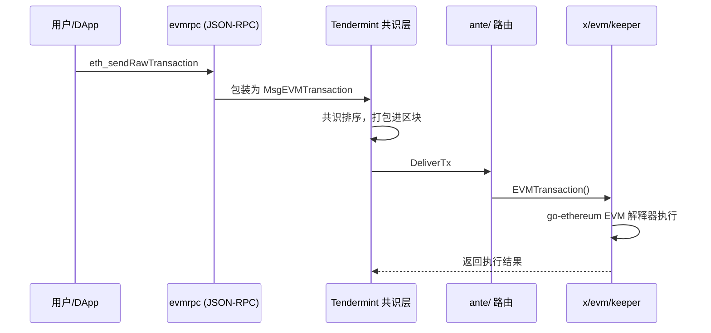
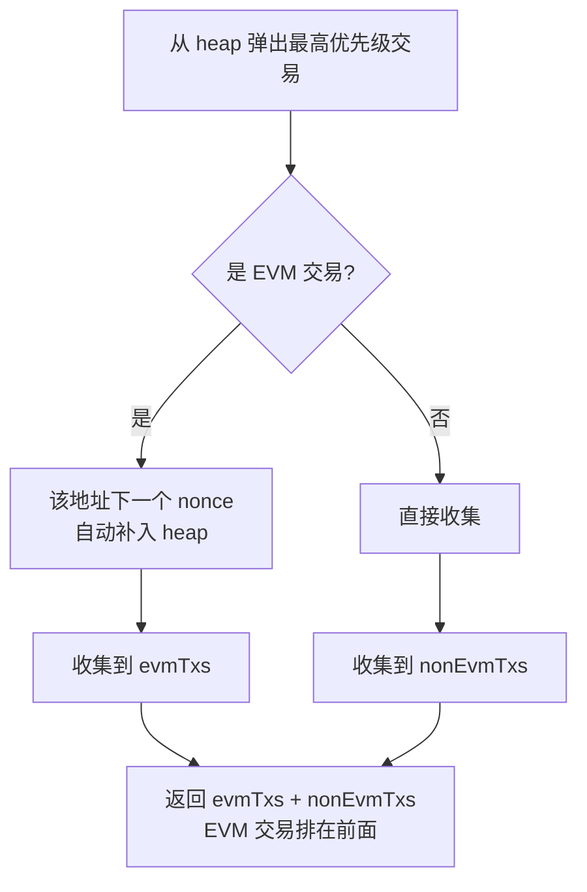

# EVM 交易生命周期

> 相关文档：[功能概览](evm-overview.md) | [存储与查询架构](evm-storage-query.md)

## 1. 交易排序与执行流程

EVM 交易的完整生命周期：

1. 用户通过 JSON-RPC 发送 `eth_sendRawTransaction`
2. 原始以太坊交易被包装为 Cosmos 的 `MsgEVMTransaction` 消息
3. 经过 **Tendermint/CometBFT 共识层**排序，进入区块
4. 在 `DeliverTx` 阶段路由到 `x/evm/keeper` 的 `EVMTransaction()` 执行



---

## 2. Mempool 中的 EVM 交易处理

### 2.1 双层数据结构

Mempool 为 EVM 交易维护了专门的 `evmQueue`，定义在 `sei-tendermint/internal/mempool/priority_queue.go`：

```go
type TxPriorityQueue struct {
    txs      []*WrappedTx            // priority heap（最大堆，按优先级排序）
    evmQueue map[string][]*WrappedTx // 按地址分组，每组按 nonce 升序排列
}
```

- **`txs`（heap）**：跨地址按 `priority` 降序排列，每个 EVM 地址**只有最低 nonce 的交易**在 heap 中
- **`evmQueue`**：`map[evmAddress] -> []*WrappedTx`，同地址交易按 nonce 升序排列

三条不变量：
1. 同一地址不能有重复 nonce
2. 同一地址不能有 nonce 间隔（gap）
3. 每个地址队列的头部（最低 nonce）必须在 heap 中

### 2.2 EVM 元数据注入

EVM ante handler（`x/evm/ante/sig.go`）验证签名后，将 EVM 元数据注入 context，最终通过 `CheckTx` 响应传递给 mempool：

```go
// CheckTx 响应中的 EVM 字段
EVMNonce         uint64
EVMSenderAddress string
IsEVM            bool
Priority         int64   // = EffectiveGasPrice / PriorityNormalizer
```

### 2.3 Nonce 路由逻辑

CheckTx 阶段根据 nonce 分三种情况：

| 情况 | 处理 |
|------|------|
| `txNonce < nextNonce` | **拒绝**（已过期 nonce） |
| `txNonce == nextNonce` | **正常**进入 mempool 主队列 |
| `txNonce > nextNonce` | 标记为 **PendingTransaction**，进入 pending 存储等待前置 nonce 就位 |

### 2.4 插入 mempool 主队列

正常交易进入 `priorityIndex.PushTx()` 时的处理逻辑：

| 场景 | 处理 |
|------|------|
| 该地址首笔交易 | 同时进入 heap + evmQueue |
| nonce < 队首 | 替换 heap 中的代表交易 |
| nonce > 队首 | 仅入 evmQueue（不进 heap） |
| 同 nonce 已存在 | priority 更高则替换（类以太坊 gas price bumping） |

### 2.5 Pending 交易异步激活

nonce 有 gap 的交易进入 `pendingTxs` 存储，附带 `PendingTxChecker` 回调。回调逻辑评估：

1. `nextNonceToBeMined` — 链上确认的下一个 nonce
2. `nextPendingNonce` — 考虑 mempool 中所有已知交易后的下一个可用 nonce

当 `txNonce < nextPendingNonce`（前置 nonce 全部就位）→ 交易被 **Accepted**，从 pending 移入主 mempool。

### 2.6 出块选择（`ReapMaxBytesMaxGas`）



### 2.7 出块后更新（`Update`）

1. 移除已出块交易（EVM 通过 `EvmTxInfo.Nonce + Address` 匹配）
2. `handlePendingTransactions()` → 评估每个 PendingTxChecker → Accepted 的移入主队列
3. 过期清理（TTL 时间 + 区块高度）

### 2.8 关键特性总结

| 特性 | 说明 |
|------|------|
| **双层结构** | heap（跨地址优先级）+ evmQueue（同地址 nonce 序） |
| **Nonce 顺序保证** | 每个地址只有最低 nonce 进 heap，弹出后下一个自动补入 |
| **同 nonce 替换** | 更高 gas price 可替换已有同 nonce 交易 |
| **Future nonce 处理** | nonce 有 gap 的交易进 pendingTxs，前置 nonce 就位后自动激活 |
| **出块优先** | EVM 交易排在 Cosmos 交易之前 |
| **优先级计算** | `priority = EffectiveGasPrice / PriorityNormalizer` |
